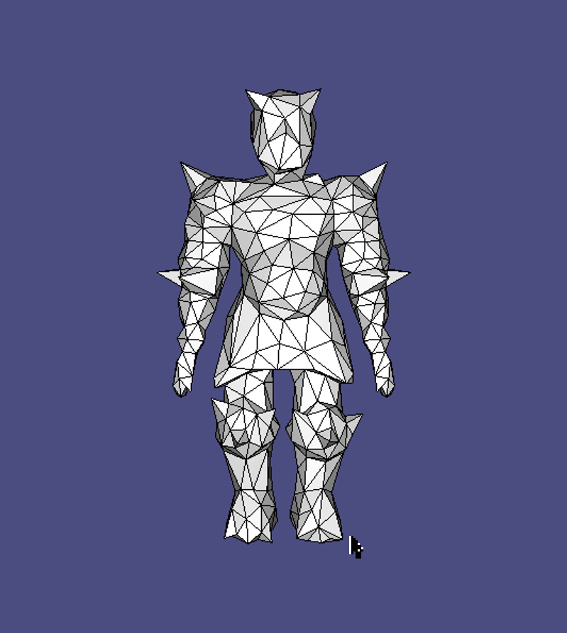
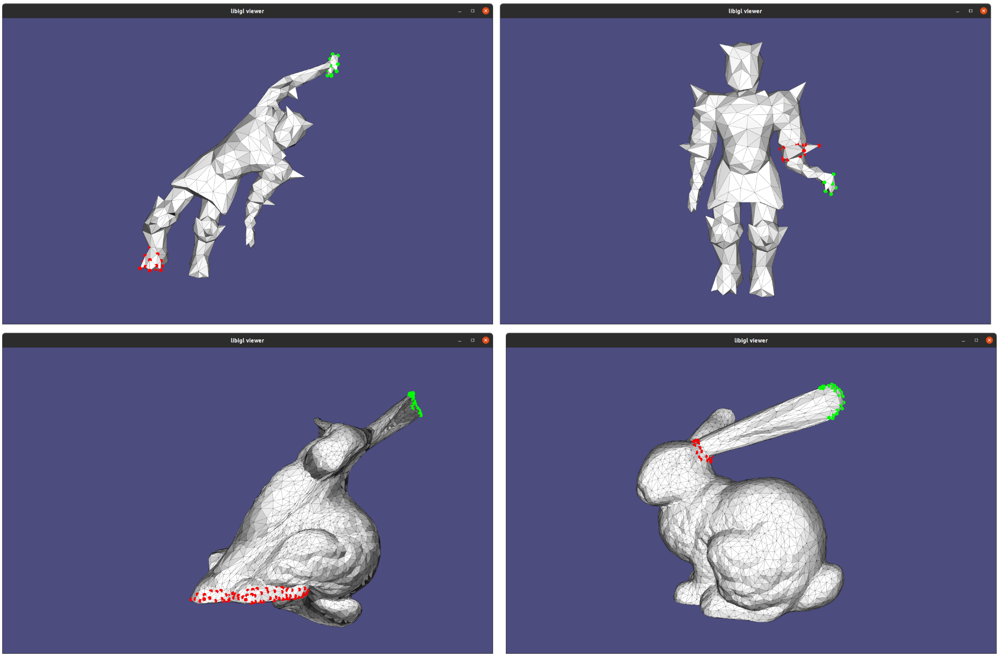

# Interactive ARAP Mesh Deformer

Our implemtation of the [As-Rigid-As-Possible (ARAP) algorithm](https://igl.ethz.ch/projects/ARAP/index.php) by Olga Sorkine-Hornung and Marc Alexa for the course [3D Scanning & Motion Capture (IN2354)](https://www.in.tum.de/cg/teaching/winter-term-2021/3d-scanning-motion-capture/) at Technical University of Munich.



## Screenshots



## Implementation

Our implementation follows the paper ["As-Rigid-As-Possible Surface Modeling"](https://igl.ethz.ch/projects/ARAP/) by Olga Sorkine-Hornung and Marc Alexa. We implemented the weight calculation as presented in ["On Linear Variational Surface Deformation Methods"](https://igl.ethz.ch/projects/deformation-survey/) by Mario Botsch and Olga Sorkine.

## Dependencies

This implementation depends on the following libaries:

- [Eigen](https://eigen.tuxfamily.org)
- [libigl](https://libigl.github.io/) (which includes OenGL & GLFW)
- [OpenMP](https://www.openmp.org/) [Optional]
- [Catch 2](https://github.com/catchorg/Catch2) [Optional]

These librabies can be installed with the following commands:

```bash
sudo apt-get install -y \
  libeigen3-dev \
  libglfw3 libglfw3-dev
```

Depending on your system setup, further dependencies might be required. Have a look at the [Dockerfile](./Dockerfile) to see how to install ALL dependencies on a clean Ubuntu setup.

## Setup

### Docker Development Environment

To run the compilation inside the Docker container, just run the docker-compose file (with `docker-compose run --rm arab-dev`) or use vscode devcontainers. Note that running in Docker containers will possibly reduce the performance.

### Building

To compile the application, run the following commands from the root directory:

```bash
cmake .
make
```

Or use [just](https://github.com/casey/just/) with `just -l` (to list all available commands) and e.g. `just build` (to build).

### Running

Setup a x11 server (e.g. https://x410.dev under Windows) and execute the binary.
In the `devcontainer.json` or `docker-compose.yml`-file the `$DISPLAY` variables might have to be adjusted, depeding on your x11 setup.

Use `just runb` to compile and run the application.

### Problems

If any issues arise, execute `just clean` before running `just build` again.

## Customization

The mesh file to load can be adjusted in the `main.cpp`. There are also a few options defined as macros in the `arap.cpp`.

## Keybindings

You can mark vertices with the left mouse button. Right mouse button to remove marked vertices. The selection mode as well as settings of the viewport can be changed by pressing keys that are listed in the console during application startup.

## Example Models

This repository comes with some example mesh `.off` ([Object File Format](<https://en.wikipedia.org/wiki/OFF_(file_format)>)) files.

The following licenses apply:

| File | License |
| - | - |
| [bunny.off](./data/bunny.off) | The Stanford 3D Scanning Repository, http://graphics.stanford.edu/data/3Dscanrep |
| [cube.off](./data/cube.off) | Created by us |
| [decimated-knight.off](./data/decimated-knight.off) | Cosmic blobs, http://www.mit.edu/~ibaran/autorig |
